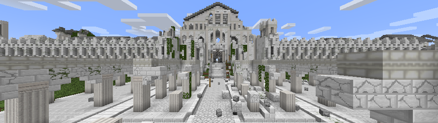

# Awaken Dreams Client 

Awaken Dreams is a total-conversion Minecraft mod that aims to capture the spirit of J.R.R. Tolkien's legendarium. This repository is specifically for the client-side version of the mod which we hope will eventually involve a fully-offline single-player adventure mode. However for the time being, the primary purpose of this mod is to enhance The Valar Project's Minecraft server. The Valar Project is the project which encompasses the Awaken Dreams mod (both client- and server-side) and a custom Minecraft server which uses the mod to help build a complete scale version of Middle-earth in Minecraft.

At the moment, the mod has hundreds of blocks and items to assist with building places from Middle-earth and contains many additional features. However we have a ways to go before our vision is fully realized. All of our code open-sourced so that others can easily help us; if you think you can help with programming, texturing, translation, or anything else, we would gladly welcome your expertise. If you are interested in contributing, we have created [some tutorials](CONTRIBUTING.md) to help you with the process.

There are multiple places you can go to get more information on The Valar Project. The first place to check out would be our [Official Website](http://tvp.elementfx.com/). We are currently maintaining a [Facebook account](https://www.facebook.com/thevalarproject/) but the best way to get involved with our community is by [joining our Discord Server](https://discord.gg/hvJrwYX). We have a large variety of people there to discuss all aspects of The Valar Project.
