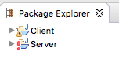
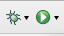
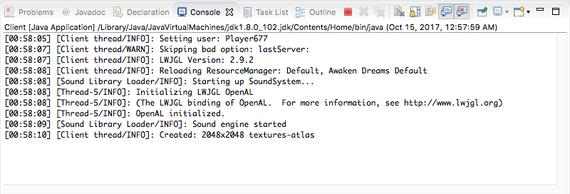

###### [Contributing Guidelines](../../CONTRIBUTING.md) > Basic Tutorials > Getting Started

# Getting Started

First off, welcome to the project, we are excited to see you taking an interest in helping us! If at any point during your time spent contributing you encounter an issue you cannot solve on your own, please don't hesitate to contact us. If it is a bug in the mod, or is something that you think others might encounter as well, [create a Github issue]() and describe your problem in as much detail as possible. Your other best option is to [join our Discord server](https://discord.gg/hvJrwYX). All of the mod's primary developers are on there, and we use it to discuss new features, issues, and so forth. Lots of non-developer members of our project are there as well to talk about everything else! We highly recommend you join even if you haven't encountered any problems yet.

## Prerequisites

### Git

Git is a version control system that we use to manage contributions, and is currently a de facto standard in the open source community. Regardless of what you want to change, you will need a basic functional understanding of git. There are plenty of resources for this online if you need them. Codecademy has an free [interactive git course](https://www.codecademy.com/learn/learn-git) if you want to learn how git works and the basic of using it. If you want be an expert on everything git (well beyond what you need to know to contribute to this course), then you will find the free online e-book [Git Pro](https://git-scm.com/book/en/v2) by Scott Chacon and Ben Straub to be very useful. We use Github for online hosting of our git repository, so you also will need a [Github account](https://github.com/login?return_to=%2FTheValarProject%2FAwakenDreamsClient).

Anyone who wants to help program the software for the mod will need an understanding of the Java language. For all of our programming tutorials, we will assume that you have a decent understanding of how to work with Java. Again there are plenty of resources available online for learning Java. Here are just a few of such resources:
- [Java Tutorial by TutorialsPoint](https://www.tutorialspoint.com/java/)
- [Introduction to Programming Using Java eBook by David Eck](http://math.hws.edu/javanotes/)
- [Java (Beginner) Programming Tutorials video series by thenewboston](https://www.youtube.com/playlist?list=PLFE2CE09D83EE3E28)

If you have modified the source, then to recompile Minecraft with the mod with your changes you will need to install the Java JDK (Java Development Kit). Even if you know that you have Java installed, it might only be the JRE (Java Runtime Environment) which as the name suggests is not enough to develop with Java. You can check if you have the JDK installed by running the command: `javac -v` and if it succeeds then you are good to go. If you are unsure, try and install it anyway. The JDK can be downloaded [here](http://www.oracle.com/technetwork/java/javase/downloads/index.html). If you are programming, then it is also highly recommended that you install the [Eclipse IDE for Java Developers](https://www.eclipse.org/downloads/packages/) as we provide a pre-made workspace for that particular IDE (more details in the Development Environment section).

## Setup and Workflow

In order to contribute, you will need to fork our repository, clone your fork, make your changes, commit, push, and then submit a pull request like many other open source projects on Github. If any of that previous sentence did not make sense to you, don't worry! [This tutorial](https://www.digitalocean.com/community/tutorials/how-to-create-a-pull-request-on-github) by Lisa Tagliaferri will guide you through the all the steps of our contribution workflow. For the time being, you only need to follow up to and including the "Create a New Branch" section. After you have set up a local repository, either on your own or by following the beginning of the linked tutorial, then you are ready to continue with the rest of this tutorial.

## Development Environment

If you want to modify the source code of the mod, the best way to do so is with the Eclipse IDE (see Prerequisites for download). Assuming you followed the previous section's instructions, you should at least have a copy of the AwakenDreamsClient repository now. Navigate to that directory in your file browser and then open up the `mcp` folder. Find the eclipse.zip and extract it to a folder called eclipse in the same directory (the `mcp` directory). Some unzipping applications will create a second eclipse folder inside the first. If that is the case move it so that there is only one level of eclipse folder. In the end you should have a directory at the path `mcp/eclipse/Client`, _not_ at `mcp/eclipse/eclipse/Client`.

Next start up Eclipse, and when it asks for a workspace, select the `mcp/eclipse` folder that you just extracted. If the extraction was successful and the right folder was selected, then it should open up a new window with two options in the Package Explorer panel to the left (you may have to close out of a welcome window first): Client and Server. It looks like this:

The `Server` project is not being used, but all of the mod code and vanilla Minecraft code can be found and modified by finding the files in the Client project. Arguably the best benefit to using Eclipse with our pre-created workspace is that you can use it to easily launch the game to test any changes you make. To do so, press the circular green play button in the top toolbar:

The button to the left of it is the debugger, and it will similarly run the game. The debugger allows you to pause the code at certain points, step through the code, and inspect variable values. It is an not necessary for development, but it can make finding bugs much easier if you know how to use it. Search around online for tutorials on how to use it if you get the chance.

When you start the game, a console tab like the one above will open up somewhere in the Eclipse window (usually at the bottom). Pay attention to this as it can print useful information, and will describe any errors that occur.

## Brief Overview of MPC

By now you're probably curious about the `mcp` folder that is in the root directory of our repository. MCP stands for Minecraft Coder Pack, and simply put it is an external tool that we use to decode the Minecraft files and encode them after making our modifications. Almost all of the important files relevant to the mod are inside the MCP so that it can be integrated with Minecraft. Here are a few of the important paths within `mcp` directory that you should be aware of:

| Path(s) | Description |
|---------|-------------|
| `recompile.sh`* | Recompiles the source code |
| `startclient.sh`* | Starts the client with the recompiled code. If you don't want to use Eclipse to test your changes, then run `recompile.sh` followed by `startclient.sh` instead.|
| `deploy.sh` | Creates a folder which can be placed directly in the versions folder of regular Minecraft to add an Awaken Dreams option to the list of Minecraft versions in the launcher. |
| `src/` | All of the source code for Minecraft and the mod. |
| `src/minecraft/assets/awakendreams/` | All the assets for the Awaken Dreams mod. If you are interested in texturing or modeling, you'll be spending most of your time here. |
| `temp/src/minecraft/assets/minecraft` | All the assets used by vanilla Minecraft. New assets do not belong here, but these can be useful as references. |
| `src/minecraft/com/elementfx/tvp/ad/` | All of the custom classes for the mod. |
| `src/minecraft/net/minecraft/` | All of the source code for vanilla Minecraft. Also contains some code from the Awaken Dreams mod, when we can't move it to a custom class. |

* .sh files are scripts for use on Mac OS and Linux only. These files have an equivalent .bat file which can be run on Windows for the same effect.

<h6 align="center"><a href="Basic_Items.md">Basic Items</a> →</h6>
